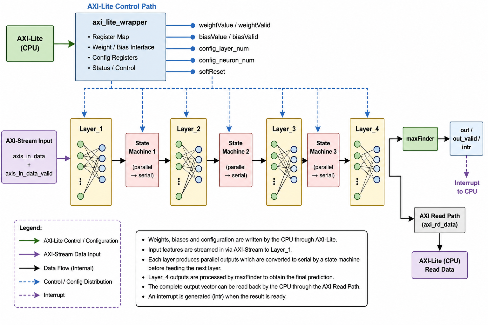
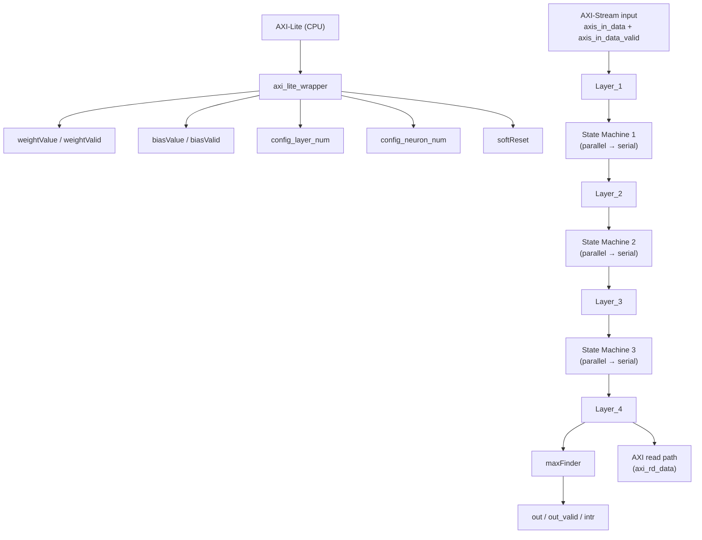

# CNN_ht
hardware trojan in CNN
## Architecture Overview

## Architecture Overview

```mermaid
flowchart TD
    CPU["AXI-Lite (CPU)"] --> ALW["axi_lite_wrapper"]

    ALW --> W["weightValue / weightValid"]
    ALW --> B["biasValue / biasValid"]
    ALW --> C1["config_layer_num"]
    ALW --> C2["config_neuron_num"]
    ALW --> SR["softReset"]

    IN["AXI-Stream input<br/>axis_in_data + axis_in_data_valid"] --> L1["Layer_1"]

    L1 --> SM1["State Machine 1<br/>(parallel → serial)"]
    SM1 --> L2["Layer_2"]

    L2 --> SM2["State Machine 2<br/>(parallel → serial)"]
    SM2 --> L3["Layer_3"]

    L3 --> SM3["State Machine 3<br/>(parallel → serial)"]
    SM3 --> L4["Layer_4"]

    L4 --> MF["maxFinder"]
    MF --> OUT["out / out_valid / intr"]

    L4 --> AXIR["AXI read path<br/>(axi_rd_data)"]
```
